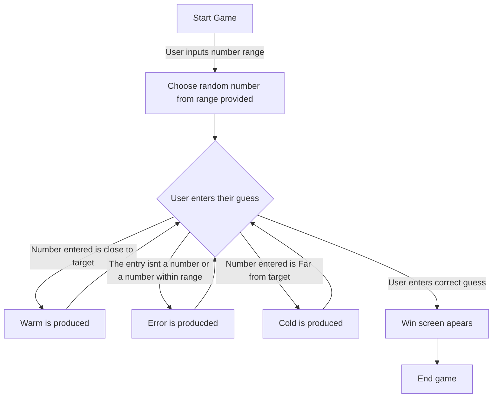

# Klin2939.github.io
Cloned Repository

Korben Kjlink@my.waketech.edu
My Github is just a place where I store old code
This repository I just created is a clone on the desktop version
first I downloaded Github on desktop then cloned the repository and then used visual studio code to then edit the README file

About Me
    <h1>About me</h1>
    
As a person I am pretty nerdy, some of my hobbies consist of yugioh, magic the gathering, pokemon, digimon, and even DnD. Academiclly I want learn how to code so that I can make my own video games. I know a little html, css, and java, but havent keep it in practice to remember all for it. I also want to learn and become fluent with spanish, In high school I learned a little bit and can put sentences togther but overall my spanish is pretty garbage.

    <h2>Video Games</h2>
    
Video games have been a big influence in my life so much so that im still chasing them into my carrer. Some of my favorite video games being; The Last of us, Elden ring, Mortal Kombat, and Dragon ball xenoverse.

    <h3>Websites</h3>
    
 [YouTube] https://www.youtube.com: Great place for entertainment and tutorials

    
 [dndbeyond] https://www.dndbeyond.com: If you play dnd this has everything you need and is what I use

# Start of the Game
1. At the start the user will enter a range of numbers that they want to guess inbetween 
2. One a range of numbers is entered the game will randomly pick a number 
3. From here the user will try to guess the number the game picked
4. If the number guessed is close to the picked number then the game will tell them their on the right track "Warm" and will give the user another chance
5. If the number guessed is far from the picked number the game will tell them their far away "Cold" and will give the user another chance
6. If the user enters any thing out side the range or something that isnt a number then the game will produce an error and will allow the user enter something else 
7. Finally if the number entered is the picked number then the game will produce a win screen
8. The game will finally end 

