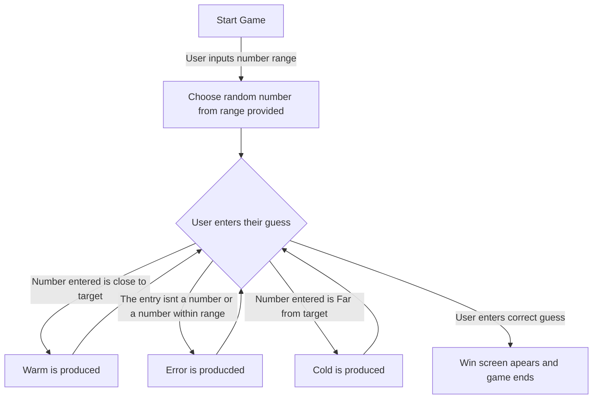

# Klin2939.github.io
Cloned Repository

Korben Kjlink@my.waketech.edu
My Github is just a place where I store old code
This repository I just created is a clone on the desktop version
first I downloaded Github on desktop then cloned the repository and then used visual studio code to then edit the README file

About Me
    <h1>About me</h1>
    
As a person I am pretty nerdy, some of my hobbies consist of yugioh, magic the gathering, pokemon, digimon, and even DnD. Academiclly I want learn how to code so that I can make my own video games. I know a little html, css, and java, but havent keep it in practice to remember all for it. I also want to learn and become fluent with spanish, In high school I learned a little bit and can put sentences togther but overall my spanish is pretty garbage.

    <h2>Video Games</h2>
    
Video games have been a big influence in my life so much so that im still chasing them into my carrer. Some of my favorite video games being; The Last of us, Elden ring, Mortal Kombat, and Dragon ball xenoverse.

    <h3>Websites</h3>
    
 [YouTube] https://www.youtube.com: Great place for entertainment and tutorials

    
 [dndbeyond] https://www.dndbeyond.com: If you play dnd this has everything you need and is what I use

